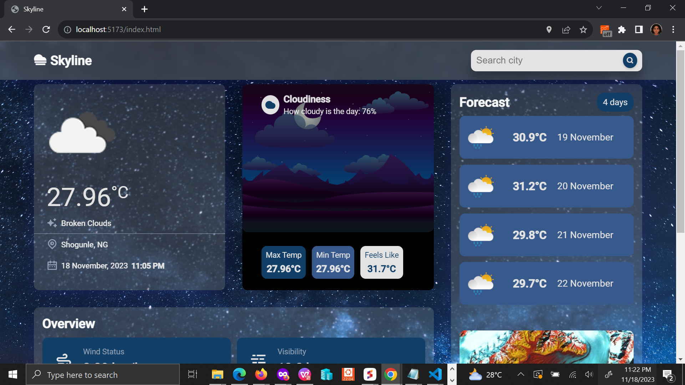
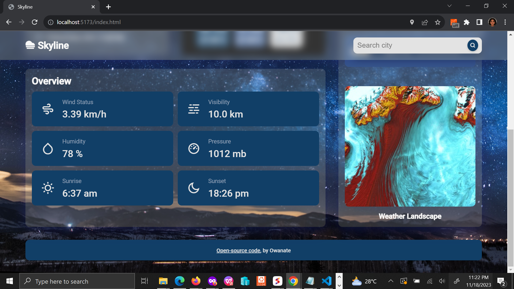

# **Skyline**
Skyline solves the challenge of getting accurate and personalized weather forecasts. The app uses a variety of data sources, including user location history and weather API, to provide users with weather condition data and forecasts that are tailored to their specific location and needs.

## Overview

### Key Features
- Weather data based on user's location.
- Weather highlights including Pressure, Wind Speed, Humidity, etc.
- Weather forecasts for up to three days. 
- Search weather data for any city in the world.

### Screenshot



### Links

- Solution URL: [GitHub](https://github.com/Owanate/skyline)
- Live Site URL: [Netlify]()

## My Process
Skyline is built using HTML, CSS, and JavaScript. It is a fully responsive web application that works on desktop and mobile devices.

### Built with

- Semantic HTML5 markup
- [SASS](https://sass-lang.com/guide/) - CSS Preprocessor 
- CSS Grid
- Mobile-first workflow
- [Javascript](https://javascript.info)

### What I learned
In this project, I learned: 
- How to properly structure the folders in my project using vite-a module bundle tool.
- How to write SCSS code that the browser can understand
- How to use Browser APIs including Fetch API, Geolocation API and Browser Storage API.
- How to write commit messages, create branches, use git and github effectively.
- How to use JavaScript Data Structures.

### Useful Resources
- Accessibility
    - [Youtube Playlist](https://www.youtube.com/playlist?list=PLNYkxOF6rcICWx0C9LVWWVqvHlYJyqw7g)
    - [Google's Web Accessibility Course](https://www.udacity.com/course/web-accessibility--ud891) - This course helped me understand accessibility really well. It is a free course that should last about 2 weeks or less. It's a great resource if you want to know more about accessibility.

### Setup 
This project is built using Vite, to run this project locally using npm 

```bash
  cd skyline
  npm install skyline
  npm run dev
```

## Disclaimer
The designs used in this app are not my own and belong to the following designers:
- [MindInventory](https://dribbble.com/shots/19207866-Weather-Forecast-Dashboard)
- [Budiarti R.](https://dribbble.com/shots/16833006-Weather-App-Dashboard-Design)
- [Shekhar Gurung](https://dribbble.com/shots/19815580-Weather-with-more)
- [Mustafa](https://dribbble.com/shots/22491548-Weather-App-Dark-Mode)

I want to give credit and recognition to the designer for their amazing work and effort in creating the designs used in this app. I have used their designs with permission and in compliance with their licensing terms. Please visit their websites to view their portfolios and to learn more about their work.